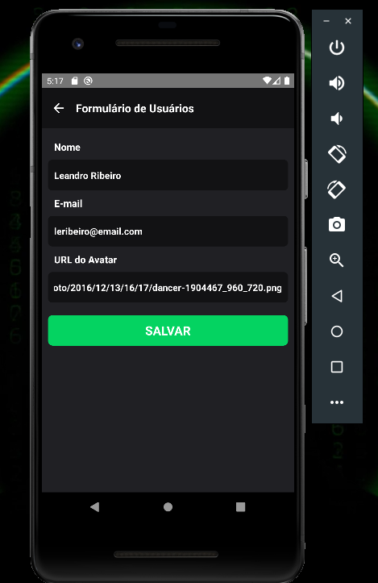
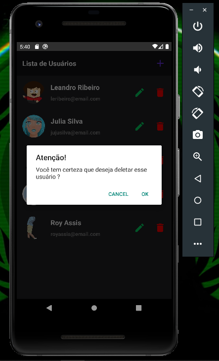
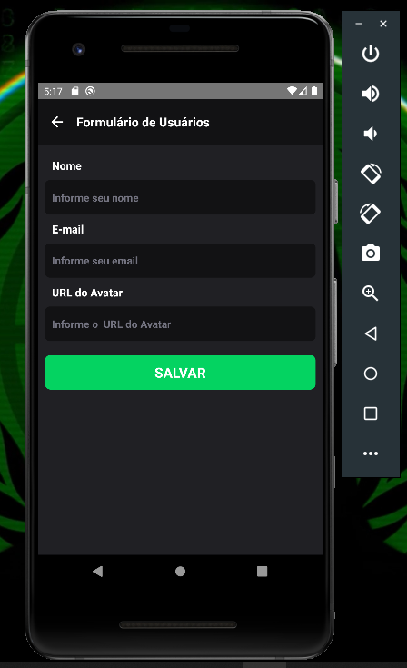

# Visualização

# Aplicação de Cadastro de Usário usando ContextAPI com useReducer

**React Native App - Cadastro de Usuário** using **ContextAPI**, **useReducer**, **StyleSheet**, **React Navigation**

## Resumo

Criar novo usuário, editar dados de um usuário já existente, deletar usuário..É uma pequena aplicação de cadastro de usuário, usando ContextAPI juntamente com useReducer, gerenciando os estados/dados de forma global da nossa aplicação.

# Running

# Install React Native

## Pré-requisitos

Antes de começar, a documentação pressupõe que você possa criar um projeto com React Native

<ul>
<li><a href="https://reactnative.dev/docs/environment-setup">React Native - Configurando o ambiente de desenvolvimento</a></li>
</ul>
<br>

Clone the repository.

```bash
git clone https://github.com/ribeiro-le/rncrudContext.git
```

Install the application in your device:

```bash
react-native run-android
```

Na raiz do projeto, execute:

```bash
npx react-native run-android
```

# Install React Navigation

```bash
npm install @react-navigation/native
```

```bash
npm install @react-navigation/native-stack
```

# Installing dependencies

```bash
npm install react-native-screens react-native-safe-area-context
```

# Installing React native vector icons

```bash
npm install react-native-vector-icons
```

## vincular a dependência

```bash
npx react-native link react-native-vector-icons
```

# Pixabay

Banco de imagens Royalty Free
Mais de 1 milhão de imagens, fotos e vídeos em alta qualidade para seus projetos.
Usamos o Pixabay, para nossos avatares.

https://pixabay.com/pt/

# Funcionalidades

<ul>
  <li>Criar um novo usuário, definindo nome, e-mail, avatar</li>
  <li>Editar os dados de um usuário já existente, podendo editar o nome, e-mail, avatar</li>
  <li>Deletar usuário</li>
   <li>Navegação</li>

</ul>

# Context

## Contexto (context) disponibiliza uma forma de passar dados entre a árvore de componentes sem precisar passar props manualmente em cada nível.

Em uma aplicação típica do React, os dados são passados de cima para baixo (de pai para filho) via props, mas esse uso pode ser complicado para certos tipos de props (como preferências locais ou tema de UI), que são utilizadas por muitos componentes dentro da aplicação. Contexto (context) fornece a forma de compartilhar dados como esses, entre todos componentes da mesma árvore de componentes, sem precisar passar explicitamente props entre cada nível.

## Mais informações

https://pt-br.reactjs.org/docs/context.html

# Hooks

## Hooks são uma nova adição ao React 16.8. Eles permitem que você use o state e outros recursos do React sem escrever uma classe.

<br>

## useReducer

Uma alternativa para useState. Aceita um reducer do tipo (state, action) => newState e retorna o estado atual, junto com um método dispatch. (Se você está familiarizado com o Redux, você já sabe como isso funciona.)

useReducer é geralmente preferível em relação ao useState quando se tem uma lógica de estado complexa que envolve múltiplos sub-valores, ou quando o próximo estado depende do estado anterior. useReducer também possibilita a otimização da performance de componentes que disparam atualizações profundas porque é possível passar o dispatch para baixo, ao invés de callbacks.

## useContext

Aceita um objeto de contexto (o valor retornado de React.createContext) e retorna o valor atual do contexto. O valor de contexto atual é determinado pela prop value do <MyContext.Provider> mais próximo acima do componente de chamada na árvore.

Quando o <MyContext.Provider> mais próximo acima do componente for atualizado, este Hook acionará um novo renderizador com o value de contexto mais recente passando para o provedor MyContext. Mesmo que um ancestral use React.memo ou shouldComponentUpdate, um renderizador ainda ocorrerá começando no próprio componente usando useContext.

## Mais informações

https://pt-br.reactjs.org/docs/hooks-reference.html

# Resultado final

<br>

## Tela início, usuários listados


<br>
<br>

## Editando usuário existente



<br>
<br>

## Deletando usuário existente



<br>
<br>

## Criando novo usuário



<br>
<br>
